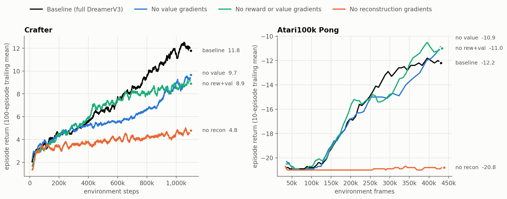
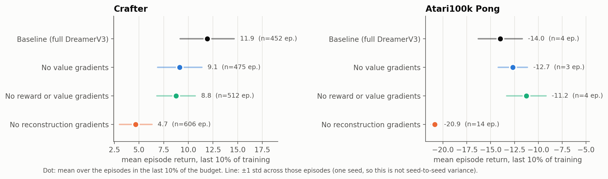
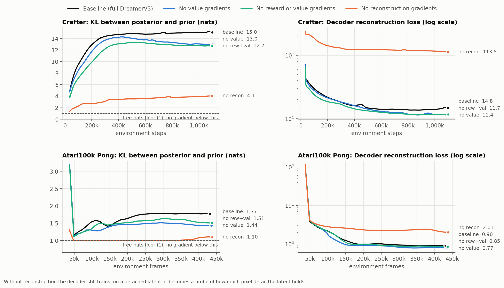
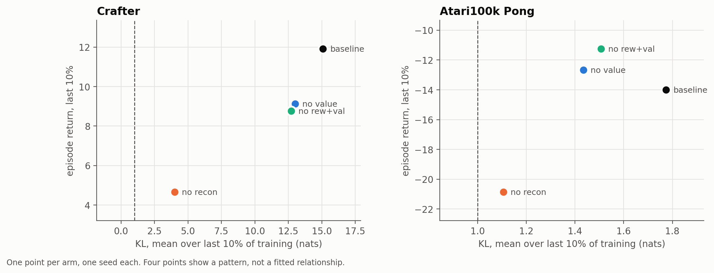

# Experiment 4 results: DreamerV3's learning-signal ablation at 12M scale

**Status: complete.** All 8 runs finished (4 arms × Crafter and Atari100k Pong, one seed
each) on a Colab A100 between 2026-09-21 and 2026-09-28. Every number below comes from
`results/summary.csv`, `results/scores_all.csv.gz` or `results/metrics_all.csv.gz`, which
the notebook's section 11 wrote from the runs' own log files. The setup, the patches and the
verification of each arm are in [`README.md`](README.md).

**In one sentence:** removing reconstruction gradients cut Crafter return by 61% and left
Pong at random-play level for the whole run, and the world model's own losses show why: the
latent took in far less information from each frame.

## Setup in brief

| | |
| :--- | :--- |
| code | upstream `danijar/dreamerv3` at `e3f0224`, plus `rec_grad.patch` (the reconstruction stop-gradient) and `atari_ale_compat.patch` |
| model | `size12m` (10,498,259 parameters on Crafter, 10,492,616 on Pong) |
| tasks | `crafter_reward`, 1.1M environment steps; `atari100k_pong`, 110K agent steps = 440K frames |
| arms | baseline; no value gradients; no reward or value gradients; no reconstruction gradients |
| seeds | 1 (seed 0) per arm |
| hardware | one Colab A100 per run, checkpoints and logs on Google Drive, resumed after disconnects |

Before any training, `inspect_agent.py` checked on the A100 that each arm zeroes exactly the
gradients it names and leaves every other gradient into the latent unchanged (to about
0.02%, the bfloat16 compilation noise between arms).

## Performance

Mean episode return over the episodes in the last 10% of each run's budget. The spread is
the standard deviation **across those episodes within the single run**, not across seeds.

| arm | Crafter | Pong |
| :--- | :--- | :--- |
| baseline | **11.9** (std 2.7, 452 episodes) | **−14.0** (std 2.3, 4 episodes) |
| no value gradients | 9.1 (std 2.2, 475) | −12.7 (std 1.5, 3) |
| no reward or value gradients | 8.8 (std 2.0, 512) | −11.2 (std 2.1, 4) |
| no reconstruction gradients | **4.7** (std 1.6, 606) | **−20.9** (std 0.4, 14) |

* **Crafter.** Removing reconstruction gradients cost 61% of the baseline's final return;
  removing value, or reward and value, gradients cost 23% and 26%. The no-reconstruction arm
  also finished more episodes (6,125 against 5,200): Crafter episodes end at death, so its
  agent died sooner.
* **Pong.** The no-reconstruction arm showed no measurable improvement in score. 130 of its
  141 episodes scored −21, ten scored −20, and its best episode (−19) came at frame 3,992,
  during the near-random start. Its quarterly means were −20.9, −21.0, −20.9 and −20.8.
  The other three arms started improving at roughly 100k to 150k frames and ended between
  −11 and −14. Their final windows hold only 3 or 4 episodes each, so they are not ranked.
  For scale, the paper's 200M model reaches −4 on Atari100k Pong (Supplementary Table 4).

## Why: what the world model learned

DreamerV3's `dyn` loss is the KL divergence between the posterior (the latent after seeing
the frame) and the prior (the model's prediction before seeing it); roughly, how much the
latent takes from each new frame beyond what it predicted. Both KL losses are clipped at
1 nat ("free bits"), and the logged value is the mean **after** clipping, so a logged 1.0
means the KL was at or below 1 at every position in the batch.

Means over the last 10% of logged steps (`results/summary.csv`):

| arm | KL, Crafter | KL, Pong | decoder loss, Crafter | decoder loss, Pong |
| :--- | :--- | :--- | :--- | :--- |
| baseline | 15.1 | 1.77 | 14.6 | 0.90 |
| no value gradients | 13.0 | 1.43 | 11.5 | 0.79 |
| no reward or value gradients | 12.7 | 1.51 | 11.6 | 0.85 |
| no reconstruction gradients | **4.0** | **1.11** | **114.8** | **2.03** |

* **Pong.** In the no-reconstruction arm the logged KL was at the 1-nat floor in 22 of its 37
  log points, from about 25k to 330k frames, and only then rose to about 1.1. Below the floor
  the KL losses give no gradient, so the only signals left to put information into the latent
  were reward and continuation prediction. They did not: the arm's reward loss stayed at
  about 0.14 until 330k frames, while the baseline's fell to about 0.02 by 150k.
* **Crafter.** The no-reconstruction arm's KL started at the floor and climbed slowly to
  about 4, against 15 for the baseline: reward and value gradients put some information into
  the latent, but far less than reconstruction.
* **The decoder probe agrees.** In the no-reconstruction arm the decoder trains on a
  detached latent, so its loss measures how much pixel detail that latent holds without being
  shaped by pixels: about 8 times worse than the baseline's on Crafter (114.8 against 14.6).
  This probe trains alongside a latent that keeps changing, so it is a pessimistic estimate;
  a fresh decoder fitted to the final checkpoint's frozen latents would be the stricter test.
* **A single-seed observation, not a finding:** removing value, or reward and value,
  gradients slightly lowered the KL and slightly improved the decoder loss. One reading is
  that those task gradients occupy part of the latent's capacity.
* Across the four arms, lower final KL goes with lower return on both tasks. Four points
  per task, one seed each: a pattern, not a fitted relationship.

The paper introduces free bits to avoid "a degenerate solution where the dynamics are trivial
to predict but contain no information about the input", and says clipping the KL losses lets
the model "focus learning on the prediction loss" once they are small. Without reconstruction that prediction loss is only reward and
continuation, and on Pong the latent stayed in the low-information state the clip leaves
unpenalised.

Open-loop predictions (last observed step, first and last imagined step; rows are true
frames, model frames and their difference) are in
[`results/figures/openloop_seed0.png`](results/figures/openloop_seed0.png). On Crafter, the
no-reconstruction arm's frames are visibly degraded already at the last observed step,
where the other three arms' difference rows are nearly empty.

## Comparison with the paper (Supplementary Figure 9)

The paper's learning-signal ablation covers 14 tasks. Two of them overlap with this run in
kind; the values below are **read off the published plot and approximate**. The ablation
section does not state its model size or seed count; the paper's defaults are the 200M model
and 5 seeds.

| | paper, Crafter, ~1.1M steps | paper, Crafter, 5M steps | this run, Crafter, 1.1M steps |
| :--- | :--- | :--- | :--- |
| full Dreamer | ~10 | ~15 | 11.9 |
| no reward or value gradients | about the same as full | ~15.5 | 8.8 |
| no reconstruction gradients | ~8 (about 20% lower) | ~12.8 (about 15% lower) | 4.7 (61% lower) |

* **Direction agrees.** Reconstruction matters most, as the paper concludes.
* **Size differs on Crafter.** The baseline here is in line with the paper's curve at the
  same step count, but the no-reconstruction gap is about three times larger. Model size
  (12M here, probably 200M there) is the likeliest reason; one seed may account for part.
* **Reward and value gradients.** The paper shows no loss from removing them on Crafter;
  this run shows 26%. With one seed that is not a reliable effect.
* **Atari.** The paper's Atari tasks are Atlantis, Breakout and Montezuma's Revenge at 20M
  steps, not Pong or Atari100k. On Atlantis and Breakout its no-reconstruction arm stays
  near zero for the whole run while the other three learn: the same pattern as Pong here.

## Limitations

* **One seed per arm.** Only the large effects (the no-reconstruction arm on both tasks)
  should be stated firmly. The value arm against the reward-and-value arm, and the ordering
  of the three learning arms on Pong, are not reliable.
* **Pong's final window** holds 3 or 4 episodes for the arms that learned.
* **12M model**, not the paper's default 200M.
* **Crafter is measured as episode return**, not the achievement-based Crafter score: the
  `crafter_reward` task logged no achievements, so these numbers are not comparable with
  published Crafter scores.
* **Resumes.** Colab disconnects meant most runs resumed from checkpoints, sometimes on a
  newer machine image (package versions were pinned). Each resume discarded up to 10 minutes
  of training; steps logged again after a resume were removed before analysis.
* **Wall time is not reported.** `wall_hours` and `sessions` in `summary.csv` count only
  sessions that ended normally, and are lower bounds.
* **`ale_py` version.** The notebook uses the author's pinned 0.9.0 if a wheel exists and
  falls back to 0.12.1 with a one-line wrapper patch otherwise. Which one the Pong runs used
  is recorded in `records/versions.txt` on Drive and has not been copied here.

## Files

| file | contents |
| :--- | :--- |
| `results/summary.csv` | one row per run: final score, spread and episode count, whole-run mean, losses over the last 10%, completion |
| `results/scores_all.csv.gz` | every finished episode of every run (`step`, `episode/score`, `task`, `size`, `arm`, `seed`) |
| `results/metrics_all.csv.gz` | every scalar DreamerV3 logged, for every run |
| `results/figures/` | the four figures above, drawn by the notebook's section 11, and the open-loop grid from section 10 |

To redraw the figures: open the notebook on a CPU runtime, run the Settings and "Where are
we running" cells, then the figures cell of section 11. `pandas.read_csv` reads the `.gz`
files directly.
